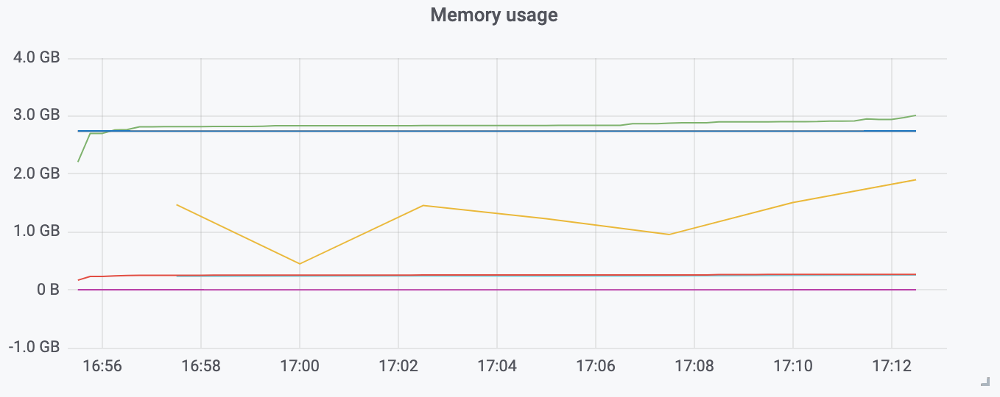

Like many I was happy to see the JDK landed support for containers in Java 9,
and that it was backported to Java 8 as well. Now the JDK 11 enables this
support by default. This support make the JVM read information from ``cgroup``s,
also the JVM has new way to tell the runtime the memory as a percentage of the
cgroup value via the `-XX:MaxRAMPercentage` flag. After some experience with it
I found this flag is not helpful in containers, at least for the application mileage
I worked with.

So, this flag did not worked as I expected to be, and I'm a bit the culprit on this one.
When this flag appeared –- as a fraction based flags first (`*RAMFraction`) -- mostly blogs
explored these options (_like this https://merikan.com/2019/04/jvm-in-a-container/[one]_),
many thanks to authors of these blogs. However I missed the most important part
`MaxRamPercentage` is **only about the Java heap**, like most blog most on the topic, leaving
the bigger picture.

If I turnned on blogs first it's because the official documentation doesn't even mention
any `*RAMPercentage` flags:

.Oracle documentation
* https://docs.oracle.com/en/java/javase/11/tools/java.html#GUID-3B1CE181-CD30-4178-9602-230B800D4FAE[`java` (JDK11)]
* https://docs.oracle.com/en/java/javase/12/docs/specs/man/java.html[`java` (JDK12)]
* https://docs.oracle.csom/apps/search/search.jsp?q=MaxRAMPercentage&search-scope=book&book=tools&product=en%2Fjava%2Fjavase%2F11&category=java[Searching Oracle's documentation]
* ...

Fortunately there's this awesome contribution from https://twitter.com/chriswhocodes[Chris Newland],
this tool indexes JDK codebase and flag's documentations among other metadata.



.https://chriswhocodes.com/hotspot_options_jdk11.html[VM Options Explorer - JDK11 HotSpot]
|===
| Name             | Since | Deprecated | Type   | OS | CPU | Component | Default                   | Availability | Description                                                  | Defined in

| MaxRAMPercentage | JDK10 |            | double |    |     | gc        | 25.0 range(0.0, 100.0) | product      | Maximum percentage of real memory used for maximum heap size | `share/gc/shared/gc_globals.hpp`

|===



I knew this tool beforehand yet I didn't use Chris's website first, I should have.
Anyway. This entry is about figuring out the other memory _parts_ of a Java process.
I will use as a specimen an issue that I experienced in production, the actual problem could
be solved without diving in memory, but it served as an excuse to go down the rabbit hole.

In doing so the following writing tries to piece together several elements
from a few things I knew, things I grepped in the JDK codebase, blog post, stack overflow,
and things learned from -- awesome -- people.

If I ignored something or if I'm wrong please reach out.

'''

To put things in context the application is running within a Kubernetes cluster
and experienced memory problems after increasing HTTP traffic.

This application is deployed as a https://kubernetes.io/docs/concepts/workloads/controllers/replicaset/[_replicaset_],
this means that Kubernetes make sure there's always the right number of application
instances, or _replicas_ using the Kubernetes terminology.
Also this deployment is using an https://kubernetes.io/docs/tasks/run-application/horizontal-pod-autoscale/[_horizontal pod auto-scaler_]
whose role is to increase the number of instances based on some criteria, this application
used the CPU usage.

.Problem
****
The application was running with `-XX:MaxRAMPercentage=85` in a container constrained
to `3 GiB` of memory and hit the memory limit. Naturally the application got killed by the
OS. And more dramatically all replicas eventually got _oomkilled_ after some time, which led
Kubernetes to always deploy new pods.

This application worked very well on a different datacenter handling all the traffic with
a heap of `2 GiB`. The instances in Kubernetes could handle half of the traffic well but not
the entire traffic.

In short when the traffic on kubernetes instances was increased to 100%
the __pod__s started to get _oom killed_.
****

On the graph above we can see the trend of the **R**esident **S**et **S**ize in green,
the Java heap limit (85% of `3 GiB`), and in yellow the current heap usage.

Note that this graph has a slight issue as it displays data in _metric bytes_
while in reality this should be IEC bytes. Talking about this :

[NOTE]
====
Most of the time, figures will use the https://en.wikipedia.org/wiki/Binary_prefix[IEC binary notation] (`1 KiB = 1024 B`),
it matches the https://github.com/corretto/corretto-11/blob/055a9a1a279b9a2953c2150bc937b04f905eeba1/src/src/hotspot/share/utilities/globalDefinitions.hpp#L226[JVM],
our https://kubernetes.io/docs/concepts/configuration/manage-resources-containers/#meaning-of-memory[Kubernetes] usage,
and Linux's tools (`/proc/{pid}/stat` or `/proc/{pid}/maps` ; although I couldn't find a reference stating this).

Some charts may however use the https://en.wikipedia.org/wiki/Binary_prefix[SI metric notation] (`1 KB = 1000 B`).

[quote, Java Performance: The Definitive Guide, Getting the Most Out of Your Code (1st Edition)]
Actually, 227,893 KB is only 222 MB. For ease of discussion, I'll truncate the KBs part by 1,000
in this chapter; pretend I'm a disk manufacturer.

_Thanks to this https://twitter.com/fleming_matt/status/1282729134481965064?s=21[tweet]._
====

.Fixing the issue without understanding
[%collapsible]
====

The application that became problematic runs on a Kubernetes cluster. As mentioned above
this application worked fine before, and the people who handled the issue at that time were
not well-prepared, and I certainly wouldn't be prepared much better, that means memory
limits until it worked. `5 GiB` proved to be the lucky number.
It was the right approach at this moment in this context as it quickly resolved production
issues.

.memory limits in the deployment object of the app
[source,yaml]
----
apiVersion: extensions/v1beta1
kind: Deployment
metadata:
  name: java-app
spec:
  template:
    spec:
      containers:
      - name: java-app
        resources:
          limits:
            cpu: "8"
            memory: 5Gi # <1>
          requests:
            cpu: "3"
            memory: 3Gi
----
<1> The working memory limit.

[TIP]
=======
The resources tree is equivalent to this docker params

[source]
----
docker run \
  --cpu-shares=3 \ # <1>
  --cpu-quota=8 \ # <2>
  --memory=5g \ # <3>
  ...
----
<1> cpu request, this is the relative weight of that container for CPU time
<2> cpu limit, this limits the CPU time of container’s processes, that means throttling
<3> memory limit, tells the OS to kill (`oomkill`) the container's processes if they hit this limit

The memory request is only used for scheduling the pod on a node.
=======

However, while increasing memory limit work this is not satisfactory because :

1. This number comes from trial and error.
2. This application worked with a `2 GiB` heap, `5 GiB` looks greedy.
3. Why this his number work is not understood.

====

_Now let's answer this question: What is consuming the memory ?_

== Diagnosis

=== Reading the JVM settings

What most of are doing when assessing java memory is to look at the Java heap.
In particular if the process is started with `\*RAMPercentage`, the JVM will compute
the actual values from the ``cgroup``s. In this case using `jcmd` it's possible to access
the runtime values.

For example with a memory limit of `5 GiB`, if a process is started with
`-XX:InitialRAMPercentage=85.0` and `-XX:MaxRAMPercentage=85.0` only the `VM.flags`
will output this :

.`VM.flags` in k8s
[source, bash]
----
$ jcmd $(pidof java) VM.flags | tr ' ' '\n'
6:
...
-XX:InitialHeapSize=4563402752 <3>
-XX:InitialRAMPercentage=85.000000 <1>
-XX:MarkStackSize=4194304
-XX:MaxHeapSize=4563402752 <4>
-XX:MaxNewSize=2736783360
-XX:MaxRAMPercentage=85.000000 <2>
-XX:MinHeapDeltaBytes=2097152
-XX:NativeMemoryTracking=summary
...
----
<1> Initial RAM at 85%
<2> Max RAM at 85%
<3> Initial heap size ~`4.25 GiB`
<4> Max heap size ~`4.25 GiB`

Do not confuse the `VM.flags` command which will output parameters calculated *from* the
_command line_ and `VM.command_line` which will print the *raw* _command line_.

The other Hotspot flag values comes are JVM defaults (which may either be static values,
or computed from internal heuristics).

That beaing said Java heap is only a part of the process memory usage.

=== Reading the memory footprint of the java process in the container

The most critical thing to look at, in particular in a container, is the _resident set size_,
it can be obtained in various ways, using `ps`, `top` or reading the `/proc` filesystem.

.`ps`
[source, role="primary"]
----
$ ps o pid,rss -p $(pidof java)
PID   RSS
  6 4701120
----

.`/proc/{pid}/status`
[source, role="secondary"]
----
$ cat /proc/$(pgrep java)/status | grep VmRSS
VmRSS:	 4701120 kB
----

On this process the RSS is `4.6 GiB`. This means that the process uses at least `0.35 GiB`
of non Java heap memory, I'll refer to this memory as native memory.

Let's dig a bit to understand this number `4701120 KiB`.

==== The java memory zones

In order to understand how the Java process memory is consumed, we need to use
_Native Memory Tracking_, fortunately the application has been started with
`-XX:NativeMemoryTracking=summary` which produces an overview of the different
memory zones that a Java process uses.

NOTE: Enabling _detailed_ native memory tracking (NMT) causes a 5% to 10% performance overhead.
The _summary_ mode only has an impact in memory usage as shown below.

NOTE: It is necessary to note that while the above command indicate a scale in `KB` for the JVM
it really means `KiB`.

.`VM.native_memory` instant snapshot
[source, bash]
----
$ jcmd $(pidof java) VM.native_memory
6:

Native Memory Tracking:

Total: reserved=7168324KB, committed=5380868KB                               <1>
-                 Java Heap (reserved=4456448KB, committed=4456448KB)        <2>
                            (mmap: reserved=4456448KB, committed=4456448KB)

-                     Class (reserved=1195628KB, committed=165788KB)         <3>
                            (classes #28431)                                 <4>
                            (  instance classes #26792, array classes #1639)
                            (malloc=5740KB #87822)
                            (mmap: reserved=1189888KB, committed=160048KB)
                            (  Metadata:   )
                            (    reserved=141312KB, committed=139876KB)
                            (    used=135945KB)
                            (    free=3931KB)
                            (    waste=0KB =0.00%)
                            (  Class space:)
                            (    reserved=1048576KB, committed=20172KB)
                            (    used=17864KB)
                            (    free=2308KB)
                            (    waste=0KB =0.00%)

-                    Thread (reserved=696395KB, committed=85455KB)
                            (thread #674)
                            (stack: reserved=692812KB, committed=81872KB)    <5>
                            (malloc=2432KB #4046)
                            (arena=1150KB #1347)

-                      Code (reserved=251877KB, committed=105201KB)          <6>
                            (malloc=4189KB #11718)
                            (mmap: reserved=247688KB, committed=101012KB)

-                        GC (reserved=230739KB, committed=230739KB)          <7>
                            (malloc=32031KB #63631)
                            (mmap: reserved=198708KB, committed=198708KB)

-                  Compiler (reserved=5914KB, committed=5914KB)              <8>
                            (malloc=6143KB #3281)
                            (arena=18014398509481755KB #5)

-                  Internal (reserved=24460KB, committed=24460KB)           <10>
                            (malloc=24460KB #13140)

-                     Other (reserved=267034KB, committed=267034KB)         <11>
                            (malloc=267034KB #631)

-                    Symbol (reserved=28915KB, committed=28915KB)            <9>
                            (malloc=25423KB #330973)
                            (arena=3492KB #1)

-    Native Memory Tracking (reserved=8433KB, committed=8433KB)
                            (malloc=117KB #1498)
                            (tracking overhead=8316KB)

-               Arena Chunk (reserved=217KB, committed=217KB)
                            (malloc=217KB)

-                   Logging (reserved=7KB, committed=7KB)
                            (malloc=7KB #266)

-                 Arguments (reserved=19KB, committed=19KB)
                            (malloc=19KB #521)

-                    Module (reserved=1362KB, committed=1362KB)
                            (malloc=1362KB #6320)

-              Synchronizer (reserved=837KB, committed=837KB)
                            (malloc=837KB #6877)

-                 Safepoint (reserved=8KB, committed=8KB)
                            (mmap: reserved=8KB, committed=8KB)

-                   Unknown (reserved=32KB, committed=32KB)
                            (mmap: reserved=32KB, committed=32KB)
----
<1> This shows a `reserved` value (`7168324 KiB` (~`6.84 GiB`)), it's the amount of addressable memory
(all OS types) on that container, and a `committed` value (`4456448 KiB` (~`4.25 GiB`)) that represents
what the JVM actually asked the OS to allocate.
<2> `Heap` zone, note that reserved and committed values are the same `4456448 KiB` here because our
`InitialRAMPercentage` is the same as max. I'm not sure why this number is different from the VM
flags `-XX:MaxHeapSize=4563402752` though.
<3> ~`162 MiB` of metaspace.
<4> How many classes have been loaded : `28431`.
<5> There are 674 threads whose stacks are using ~`80 MiB` at this time.
<6> `Code` cache area (assembly of the used methods) ~`102 MiB` out of ~`246 MiB`.
<7> This section contains `GC` algorithms internal data structures, this is app is using G1GC which takes ~`225 MiB`.
<8> C1 / C2 compilers (which compile bytecode to assembly) use ~`5.8 MiB`.
<9> The `Symbol` section contains many things like interned strings and other internal constants for about `28.2 MiB`.
<10> The `Internal` area takes ~`24 MiB`. Before Java 11 this area included `DirectByteBuffers`, but from Java 11 those
are accounted in the `Other` zone.
<11> The `Other` section after Java 11 includes `DirectByteBuffers` ~`261 MiB`.

The remaining areas are much smaller in scale, NMT takes ~`8.2 MiB` itself, module system usage ~`1.3 MiB`,
etc. Also, note that enabling other JVM features may show up if they are activated, like flight recorder.
https://docs.oracle.com/en/java/javase/11/troubleshoot/diagnostic-tools.html#GUID-5EF7BB07-C903-4EBD-A9C2-EC0E44048D37[Source]

There's a lot more to read on the
https://docs.oracle.com/en/java/javase/11/vm/native-memory-tracking.html#GUID-39676837-DA61-4F8D-9C5B-9DB1F5147D80[official documentation about NMT]
and https://docs.oracle.com/en/java/javase/11/troubleshoot/diagnostic-tools.html#GUID-1F53A50E-86FF-491D-A023-8EC4F1D1AC77[how to Monitor VM Internal Memory].

Yet another worthwhile read on https://shipilev.net/jvm/anatomy-quarks/12-native-memory-tracking/[native memory tracking]
by http://twitter.com/shipilev[Aleksey Shipilёv].

==== Let's pause a bit and revise memory management

I mentioned it already : the _RSS_ or **R**esident **S**et **S**ize, what is it? What exactly means
_committed_ memory ? Or _reserved_ memory ? How do they relate to each other?

First let's break down the vocabulary when we talk about memory.

.memory zones
[ditaa]
----

|<--virtual memory----------------------------------------->|
|<--reserved memory--------------------------->|            |
|<--committed memory-------------->|           |            |
:                                  :           :            :
+-------------------+------+-------+-----------+------------+
| addressable space of the process                          |
+-------------------+------+-------+-----------+------------+
|                                                           |
|<--contiguous addresses----------------------------------->|
|                                                           |
0                                                   0x8000000

----

.vocabulary breakdown (https://stackoverflow.com/a/31178912/48136[source])
[%autowidth.stretch]
|===

| *Committed* | Address ranges that have been mapped or ``malloc``ed.
They may or may not be backed by physical or swap due to lazy allocation and paging.
This applies to the JVM and the OS.

| *Reserved* | The total address range that has been pre-mapped via `mmap` or `malloc` for a
particular memory pool. In other words _reserved memory_ represents the maximum addressable memory.
Those could be referred to as *uncommitted*.
This applies to the JVM and the OS.

| *Resident* | OS memory pages which are currently in physical ram. This means codes, stacks, part of the
committed memory pools but also portions of ``mmap``ed files which have recently been accessed
and allocations outside the control of the JVM.
This only relate to the OS.

| *Virtual* | The sum of all virtual address mappings. Covers committed, reserved memory pools but also mapped
files or shared memory. This number is rarely informative since the JVM will reserve large address
ranges upfront. We can see this number as the pessimistic memory usage.
This only relate to the OS.

|===

The graph above does not show resident memory, indeed, the above graph is mostly about the
layout of the address space of a (Java) process. However, to talk about resident memory
it's necessary to remind how OSes, and Linux in this article, manage memory through the concept of
*paging*.

The virtual address space is divided into smaller chunks called _pages_. I only saw pages of `4 KiB`
but other sizes exists and may even co-exists (e.g. having pages of 4 KiB mixed with 2 MiB pages), it
all depends on the processor architecture. Anyway that's something that is out of scope for this
writing. What is interesting is how paging and RSS relate to each other.

.paging (for a single process)
[ditaa]
----

+-+ touched/used  +-+ untouched/unused
| | page          : | page
+-+               +-+

|<--virtual memory----------------------------------------->|
|<--reserved memory------------------------------>|         |
|<--committed memory--------------->|             |         |
:                                   :             :         :
+-+=+=+-+=+-+-+-+=+=+=+=+=+-+=+=+=+=+=+=+=+=+=+=+=+=+-+=+=+-+
| | | | | | | | | | | | | | | | | | | | | | | | | | | | | | |
+-+-+-+-+-+-+-+-+-+-+-+-+-+-+-+-+-+-+-+-+-+-+-+-+-+-+-+-+-+-+
 | |   |   |           |   |                         |     |
 | \\  \\  \----\   /--/   \-----\             /-----/     |
 |  |   |       |   |            |             |  /--------/
 |  |   |       |   |            |             |  |
 v  v   v       v   v            v             v  v
/--+---+--+----+---+---+--------+-----+-----+-------\
|0 |1  |2 |... |40 |50 |...     |1000 |2000 |...    |
+--+---+--+----+---+---+--------+-----+-----+-------+ MMU
|9 |50 |7 |... |2  |   |...     |6000 |6001 |       |
\--+---+--+----+---+---+--------+-----+-----+-------/
  |             |         |       |            |
  |           /-/         |       |            |
  |      /----|-------------------/            |
  |      |    |           |                    |
+-|------|----|--+        |              +-----|--------+
| v      v    v  |        |              |     |        |
| ++ ++ ++ ++ ++ |        |              |     |        |
| ++ ++ ++ ++ ++ |        |              |     v        |
| ++ ++ ++ ++ ++ |        |              |+-------+     |
| ++ ++ ++ ++ ++ |        \-------------->|swap   |     |
| ++ ++ ++ ++ ++ |                       |+-------+     |
+----------------+ RAM                   +--------------+ Disk

----

As shown in the graph above the addressable space of a process is divided in _pages_.
These pages have to be stored physically, either in RAM or on disk. The real memory
address is naturally different from this virtual address space for the process.
It's the job of the MMU (Memory Management Unit) to perform the translation between
virtual addresses and physical addresses.

One of the advantage of virtual memory is providing to a process the illusion of very
big memory. The trick behind that is that not all memory is used at the same time,
thus allowing:

* to not use physical memory frames if the process didn't yet _touch_ this page
* to use a slower device to store pages, usually a disk, in special part called _swap_

To understand _RSS_ the diagram above is enough as it shows where
used process memory may _resides_, in RAM or in a secondary storage (like a disk).
The _resident set size_ which means the total size of pages of a process either
in RAM or in secondary storage, that is without untouched/unused pages.
This contrasts with VSZ or virtual size which includes the total address space of
a program, which can be very large.

_If you want to dive how the whole paging thing works head to
system courses where they usually explain in depth how everything interacts._

To put things in perspective I'd like to explain one last thing to memory management
with the JVM perspective.

===== Reserved and committed memory in the JVM

As mentioned above one of the idea of the *reserved* / *committed* memory is to
provide the illusion of a single *continuous* memory space.

Concretely for the JVM it means that the _committed_ memory is immediately usable,
and the _reserved_ memory part means memory _put on hold_ and not usable.
Now with a better understanding of how memory works let's look again at the output
of the `VM.native_memory` command to make more sense of it:

[source, bash]
----
Total: reserved=7168324KB, committed=5380868KB                               <1>
-                 Java Heap (reserved=4456448KB, committed=4456448KB)        <2>
                            (mmap: reserved=4456448KB, committed=4456448KB)
...
-                     Class (reserved=1195628KB, committed=165788KB)         <3>
...
-                    Thread (reserved=696395KB, committed=85455KB)           <4>
...
-                      Code (reserved=251877KB, committed=105201KB)
...
-                        GC (reserved=230739KB, committed=230739KB)          <5>
...
----
<1> The process addressable memory and what is currently committed.
<2> Here the NMT also show the same abstractions of committed and reserved memory,
on this process these values are the same because the `InitialHeapSize` (`Xms`) and
`MaxHeapSize` (`Xmx`)are the same. If these boundaries were different it is likely
the heap zone would show different values for reserved and committed memory; the
JVM will increase the committed memory if necessary, and can even uncommit some of
this memory if the GC algorithm allows it.
<3> Class, Code spaces works the same way, specifics JVM flags control the reserved
and committed memory.
<4> Java Threads are allocated within the process memory, the JVM flags only control
the size of a thread. I will expand on this later.
<5> Then comes the other memory space of the JVM, like the GC internal structures, who
are using a different memory management, these zones usually have the same reserved/committed
amount.

Iterating on the graph above the memory is split in smaller regions.

.JVM memory zones
[ditaa]
----

|<--virtual memory----------------------------------------------------->|
|<--reserved memory------------------------------------------------->|  |
|<--committed memory--------------------------------------------->|  |  |
|<--heap max size-------->|<--Class reserved--->|<--others-->|    |  |  |
|<--committed heap--->|   |<--Class commited->| |            |    |  |  |
|<--used heap---->|   |   |                   | |            |    |  |  |
:                 :   :   :                   : :            :    :  :  :
+-----------------+---+---+-------------------+-+------------+----+--+--+
| addressable space of the process                                      |
+-------------------+------+-------+-----------+------------------------+
|                                                                       |
|<--contiguous addresses----------------------------------------------->|
|                                                                       |
0                                                               0x8000000

----

This immediately leads to new vocabulary :

.Java memory vocabulary
[%autowidth.stretch]
|===

| *Used Heap* | The amount of memory occupied by live objects and to a certain extent object
that are unreachable but not yet collected by the GC. This only relate to the JVM Java heap.

| *Committed heap* | The current limit if the writable memory to write objects to.
It's the current workspace of the GC. Upon process start this value should be equal to `Xms`,
then the GC may expand it up to the Java heap reserved memory, or in Java terms the heap max size,
or `Xmx`.

| *Heap Max Size* | The maximum amount of memory that the Java heap can occupy.
It's the _reserved_ amount in Java Heap section of the NMT output.
If the application requires more memory this will result in a `OutOfMemoryError`.

|===

So committed stands for writable memory and reserved stands for total addressable space
of the memory. Hiw does it work concretely?

The JVM starts by https://github.com/corretto/corretto-11/blob/3b31d243a19774bebde63df21cc84e994a89439a/src/src/hotspot/os/linux/os_linux.cpp#L3421-L3444[_reserving_ the memory],
then parts of this "reserve" will be made available by
https://github.com/corretto/corretto-11/blob/3b31d243a19774bebde63df21cc84e994a89439a/src/src/hotspot/os/linux/os_linux.cpp#L3517-L3531[modifying the memory mappings]
using `malloc`, `mmap`, as well as `mprotect` calls in particular (on Linux).

===== `malloc` and `mmap`

The `malloc` and `mmap` C calls ask the OS to allocate memory. And it's the job of the OS to
provide the application the necessary memory, or fail if not possible.

Also, depending on the mapping in particular for `mmap` the OS can be asked to make a file
accessible as a memory zone, in short it's the kernel that perform IOs, in contrast to perform
IOs with a file descriptor application side.

image:../../static/assets/maxrampercentage/malloc-mmap.svg[align="center", title="Simple overview of malloc and mmap"]

.Differences between https://linux.die.net/man/3/malloc[`malloc`] and http://www.kernel.org/doc/man-pages/online/pages/man2/mmap.2.html[`mmap`]
[%collapsible]
====
* `malloc` may _recycle_ previously used memory that was released by `free`,
and perform a system call to get memory only required. It's part of the C standard.

* `malloc` allows you pass a size and that's basically it.

* `mmap` is a system call. It's not part of the C standard, and may not be available
on all platforms.

* `mmap` can both map private memory or shared memory (as in shared with other processes).
Those are called _anonymous mapping_ using flag `MAP_ANONYMOUS`.

* `mmap` can also interact with disk files on specific ranges, without having
a file descriptor.

* `mmap` can be set with various flags that are used to control how this memory
mapping behave.

* Both have their performance characteristics, `malloc` is usually preferred for
few and small allocations, `mmap` is preferred for few but large allocations.
====

When the JVM bootstrap, it requests a main memory of a certain size with the `PROT_NONE`
flag to prevent any access. This has the effect to tell the OS that this mapping should
not be backed by physical memory. Then when memory regions are needed, typically during
bootstrap, or when new java threads are created, the JVM changes the mapping for a
sub-range of that main memory by removing the `PROT_NONE` flag.

.Simple code example
[%collapsible]
====

To help you understand here's a very simple program:

. that *reserves* `16 MiB` via a `malloc` call and `16 MiB` via the `mmap` call
. then this program will invoke `ps` to show its actual memory consumption (RSS)
. then it will touch/use memory by setting a bit every `1 KiB`
. then this program will invoke `ps` again to show its actual memory consumption (RSS)

.memory example
[source,c,role="primary"]
----
#include <stdio.h>
#include <stdlib.h>
#include <unistd.h>
#include <sys/mman.h>

#define HEAP_SIZE (16 * 1024 * 1024 * sizeof(char))

int main (int argc, char *argv[])
{
  char *heap1 = malloc(HEAP_SIZE);
  char *heap2 = mmap(0, HEAP_SIZE, PROT_NONE|PROT_WRITE, MAP_PRIVATE | MAP_NORESERVE | MAP_ANONYMOUS, -1, 0);

  pid_t pid = getpid();
  printf("pid: %d\n", pid);

  char buffer[50];

  sprintf(buffer, "ps -p %d -o rss,vsz,command", pid);
  printf("Executing: '%s'\n", buffer);
  system(buffer);

  printf("Writing to some pages, but not all\n");

  for (char* i = heap1; i < (heap1 + HEAP_SIZE / 16); i += 1024) {
    *i = 0x01;
  }
  for (char* i = heap2; i < (heap2 + HEAP_SIZE / 8); i += 1024) {
    *i = 0x01;
  }

  sprintf(buffer, "ps -p %d -o rss,vsz,command", pid);
  printf("Executing: '%s'\n", buffer);
  system(buffer);

  free(heap1);
  munmap(heap2, HEAP_SIZE);

  return 0;
}
----

.result
[source,shell,role="secondary"]
----
$ gcc -Wall -Wpedantic -o heap-malloc heap-malloc.c && ./heap-mem
pid: 4301956

Executing: 'ps -p 2904 -o rss,vsz,command'
   RSS      VSZ COMMAND
   708  4301956 ./test-mem
Writing to some pages, but not all
Executing: 'ps -p 2904 -o rss,vsz,command'
   RSS      VSZ COMMAND
  3780  4301956 ./test-mem
----

As the `stdout` shows the RSS of this program is very low until memory is actually written to. At the same time
the virtual memory is much, much higher; it means this simple program could address up to
about `4 GiB`.

_This program ran on a MacBook Pro 2018 running an Intel Core i7 CPU._
====

== Move elsewhere

=== virtual memory and paging

*Virtual memory* is a memory management scheme that is used by most operating systems ;
it allows programs to use memory without dealing with hardware, or other concerns like
sharing the memory resource. In doing so it allows programs to request more memory than
available. In this scheme the OS splits the virtual memory and the memory in smaller chunks
called *pages*. For any given page in the virtual memory, and depending on the application(s)
the OS may:

* make this page resident in physical memory, if something has be written into it
* do nothing if a page is not used, this page is virtually available
* move a page from physical memory to swap, if the OS thinks there's not enough room for other pages
* map ta portion of a file to this page

image:../../static/assets/maxrampercentage/os-memory-paging.svg[align="center", title="Simple overview of OS paging"]

E.g at the moment this report was executed the committed memory is `5380868 KiB` (`5.13 GiB`) while
the process RSS is `4701120 KiB`. The difference relates to how `mmap` works (on Linux), memory
pages are only backed by physical memory once they're written to.

Some people may have heard of the `-XX:+AlwaysPreTouch` Hotspot option. This option tells
the JVM to https://github.com/corretto/corretto-11/blob/3b31d243a19774bebde63df21cc84e994a89439a/src/src/hotspot/share/runtime/os.cpp#L1825-L1829[write a zero to every OS memory pages].
This option has the effect of avoiding physical memory commit latencies at runtime, however this
only affects the heap memory zone. Other areas like thread stack or metaspace work differently.

In other words that means parts of the *committed* memory shown in NMT is not *resident* and as such
RSS counter may not reflect what is een in the *committed* memory.

Now that we revised some basics, let's go back to the trail.
