This draft exercises every diagram type registered by the Mermaid `11.17.2` core browser bundle.
The five C4 forms and four railroad grammars have separate examples. ZenUML is not included because
Mermaid distributes it as a separate plugin.

## Flowchart

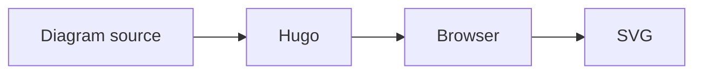

## ELK flowchart

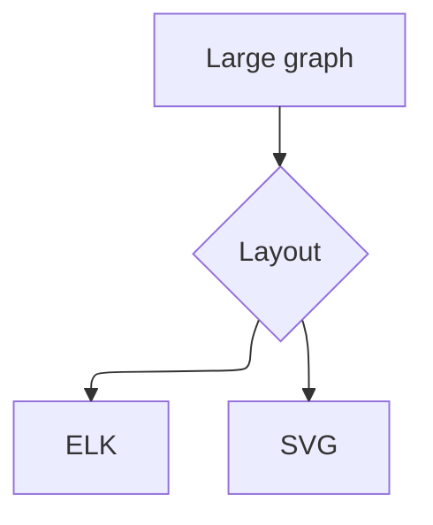

## Sequence diagram

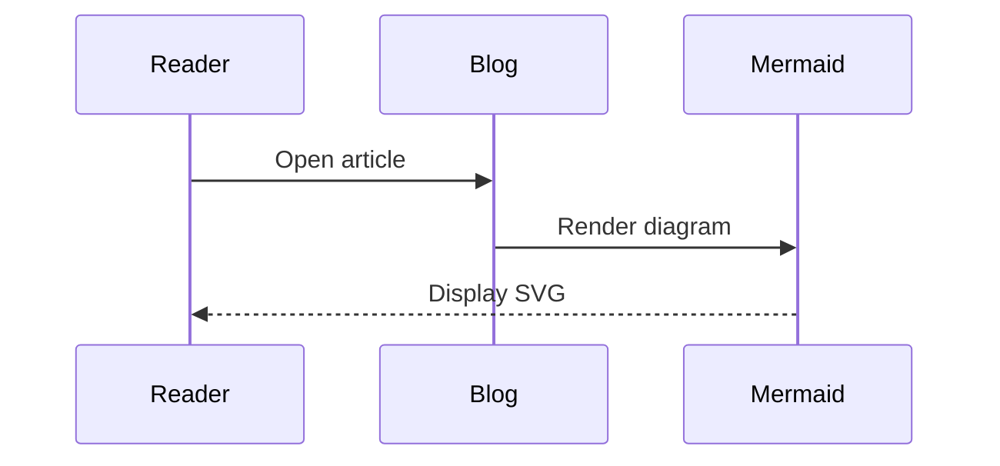

## Class diagram

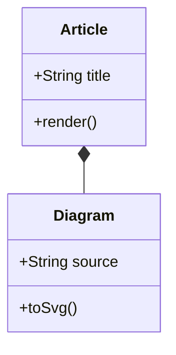

## State diagram

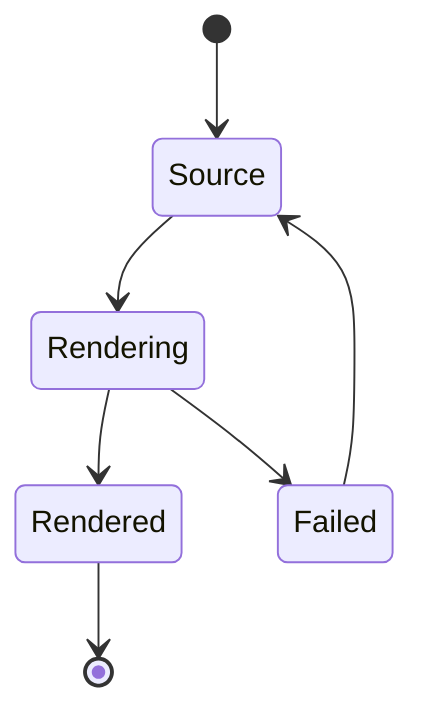

## Entity relationship diagram

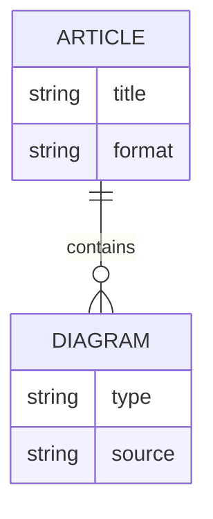

## User journey

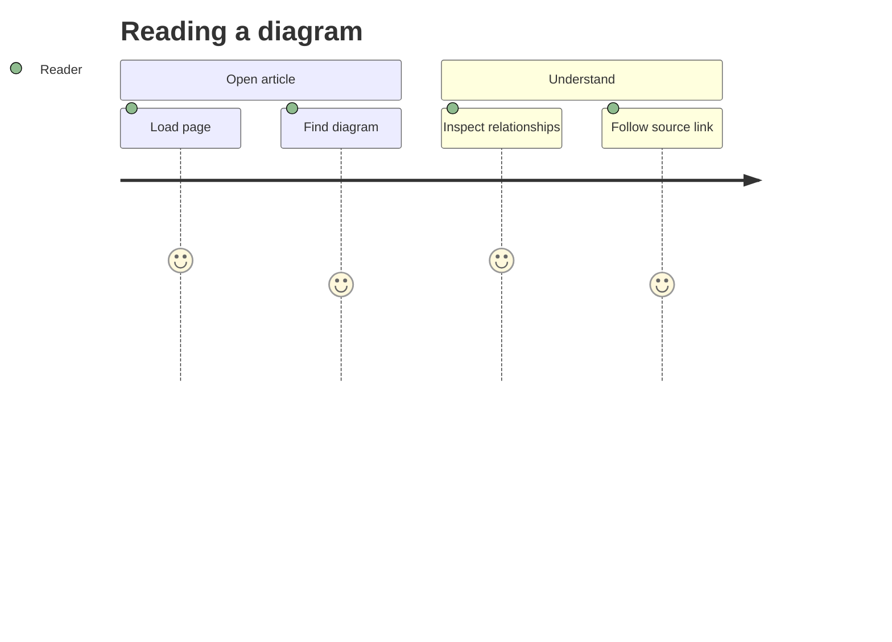

## Gantt chart

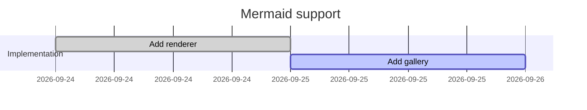

## Pie chart

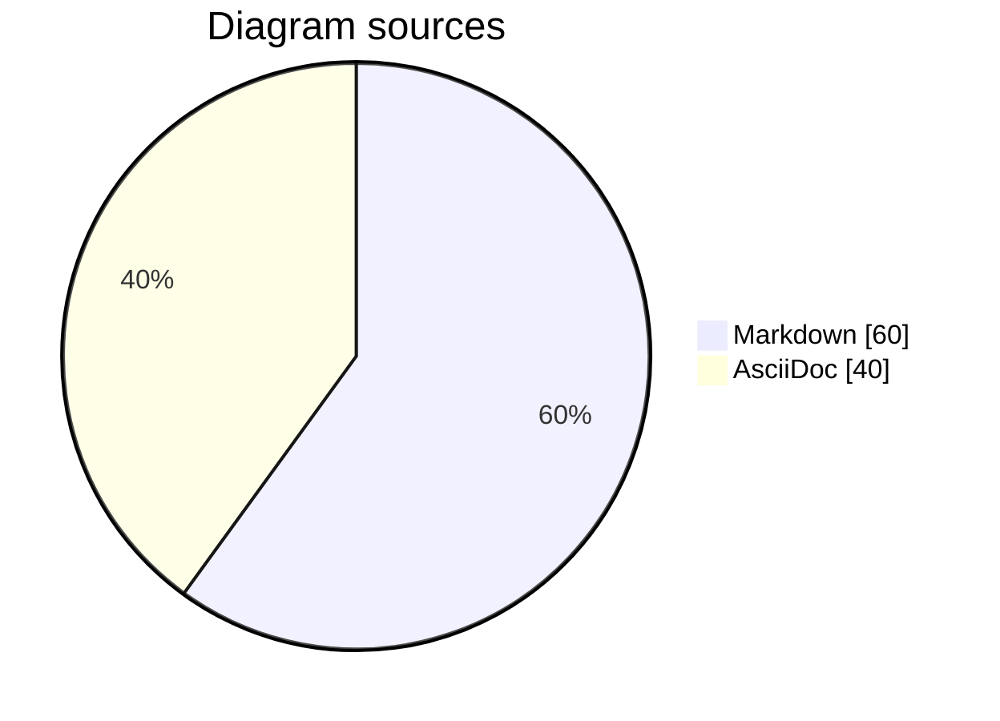

## Quadrant chart

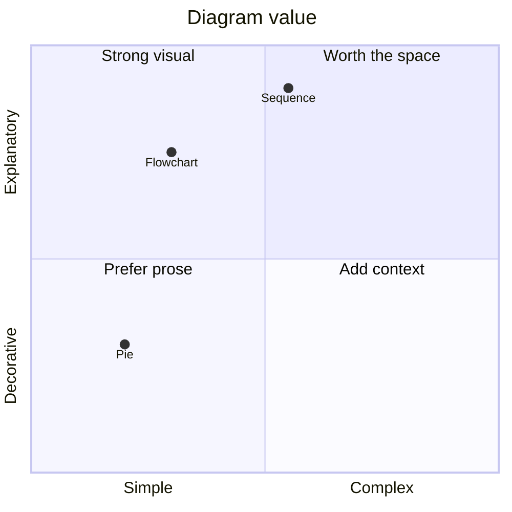

## Requirement diagram

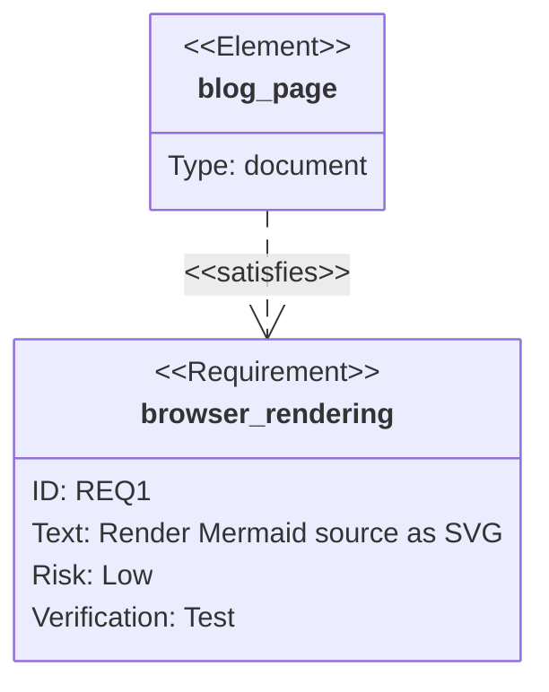

## Git graph

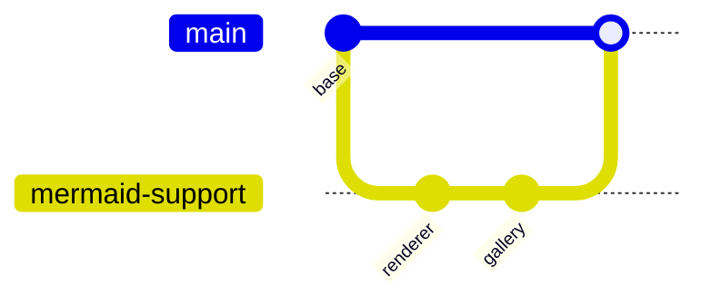

## C4 system context

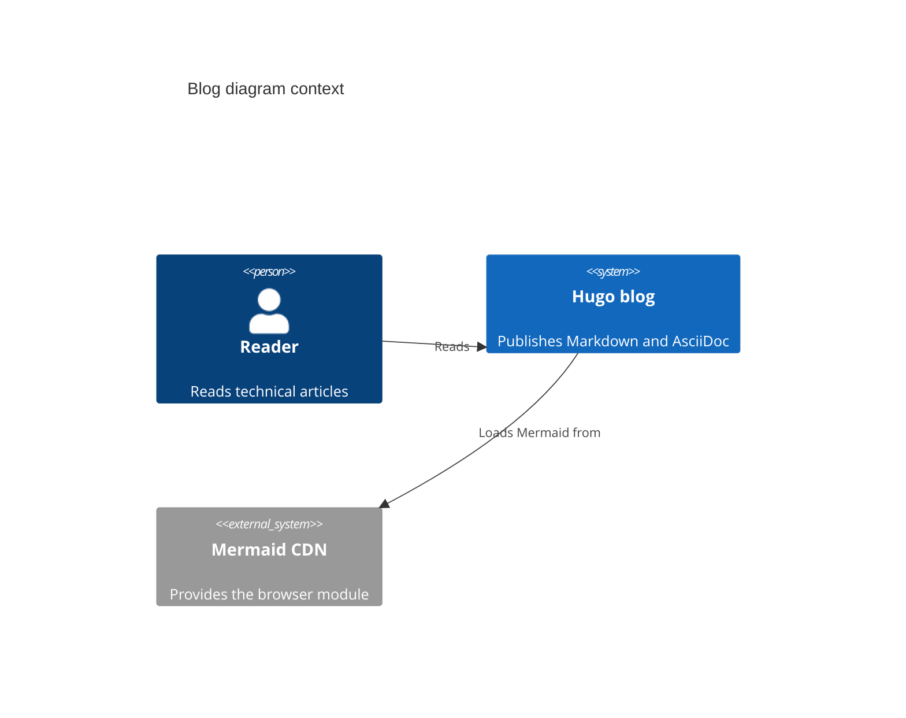

## C4 container

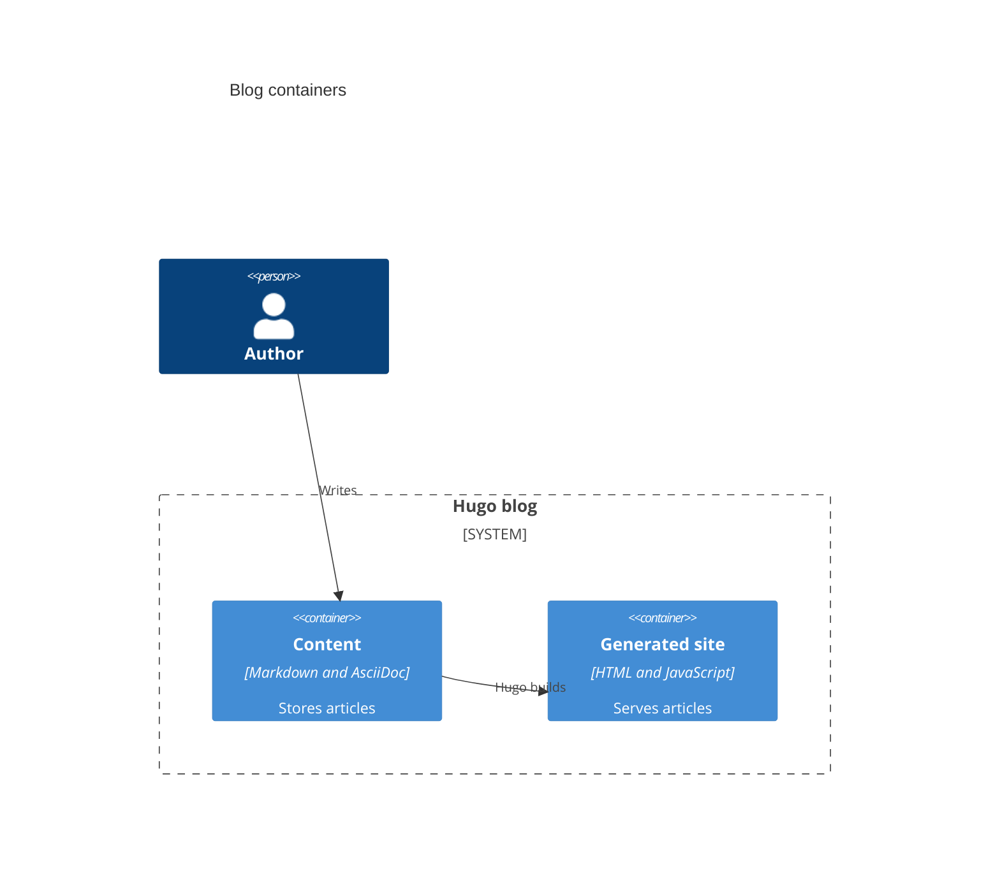

## C4 component

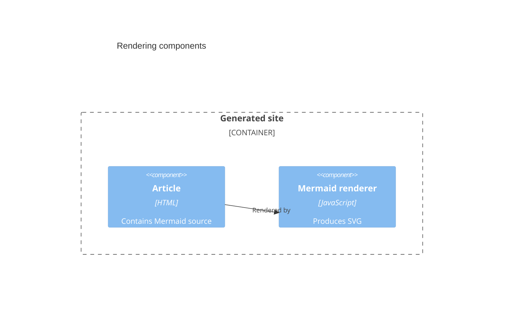

## C4 dynamic

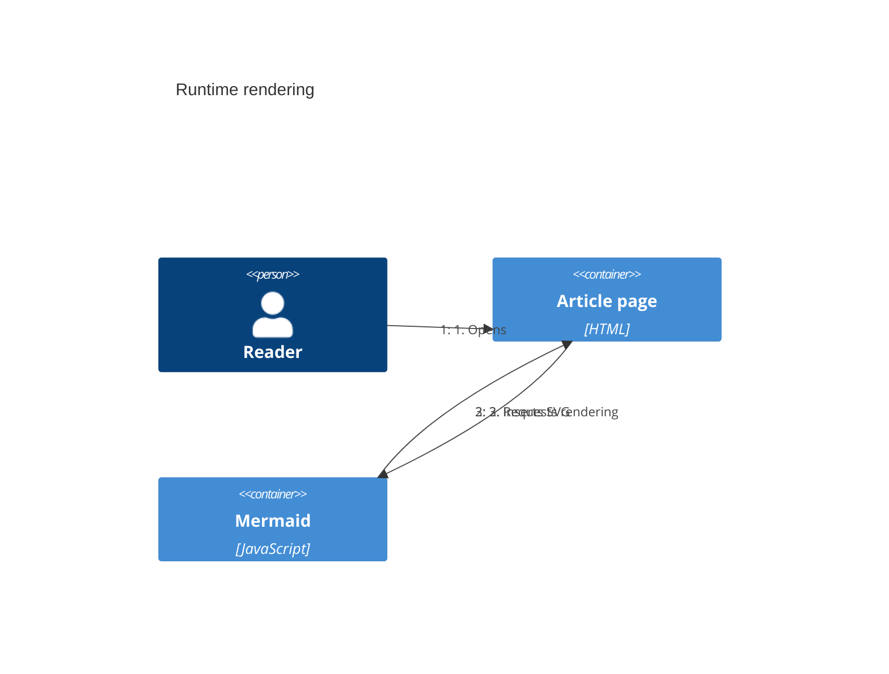

## C4 deployment

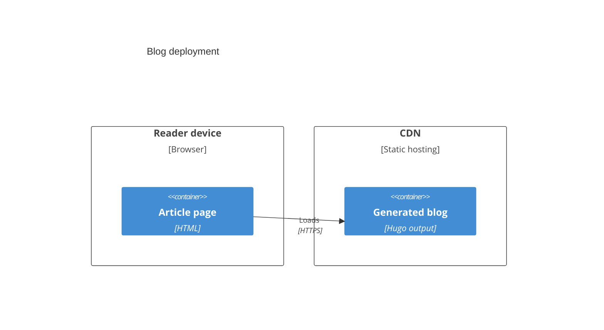

## Mindmap

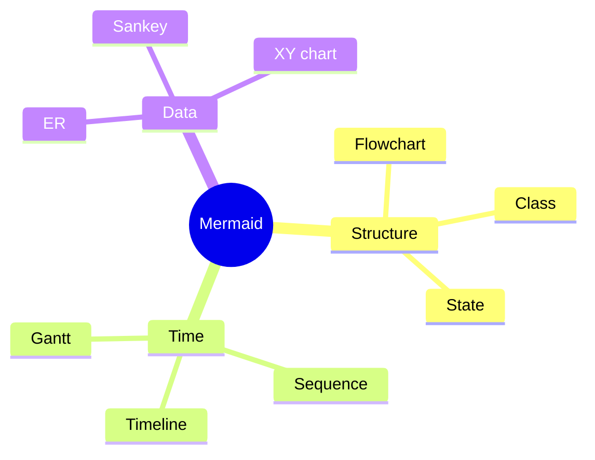

## Timeline

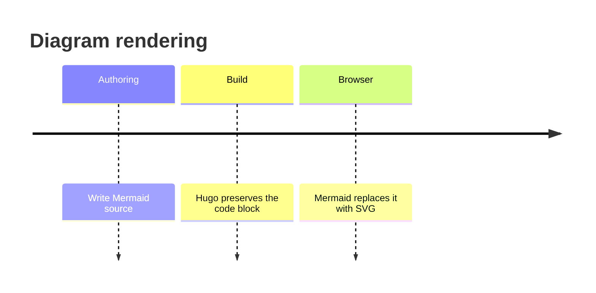

## Sankey diagram

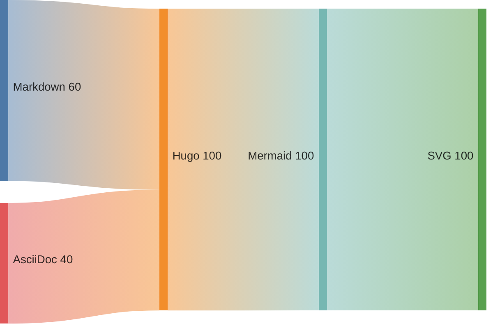

## XY chart

```mermaid
xychart
    title "Rendered diagrams"
    x-axis [Flowchart, Sequence, Class, State, ER]
    y-axis "Count" 0 --> 10
    bar [8, 6, 4, 5, 3]
    line [7, 7, 5, 4, 4]
```

## Block diagram

```mermaid
block-beta
    columns 3
    Source space Renderer
    space:2 SVG
    Source --> Renderer
    Renderer --> SVG
```

## Packet diagram

```mermaid
packet-beta
    0-3: "Version"
    4-7: "Type"
    8-15: "Length"
    16-31: "Diagram payload"
```

## Kanban board

```mermaid
kanban
    backlog[Backlog]
        source[Write source]
    active[Rendering]
        parse[Parse diagram]
    done[Done]
        svg[Display SVG]
```

## Architecture diagram

```mermaid
architecture-beta
    group blog(cloud)[Blog]
    service content(disk)[Content] in blog
    service hugo(server)[Hugo] in blog
    service browser(internet)[Browser]
    content:R -- L:hugo
    hugo:R -- L:browser
```

## Radar chart

```mermaid
radar-beta
    axis clarity["Clarity"], speed["Speed"], detail["Detail"], reach["Reach"]
    curve prose["Prose"]{90, 85, 80, 95}
    curve diagram["Diagram"]{85, 70, 95, 80}
    max 100
    min 0
```

## Treemap

```mermaid
treemap-beta
"Structural"
    "Flowchart": 30
    "Class": 20
    "State": 15
"Temporal"
    "Sequence": 25
    "Timeline": 10
```

## Venn diagram

```mermaid
venn-beta
    title "Authoring support"
    set Markdown
    set AsciiDoc
    union Markdown,AsciiDoc["Mermaid diagrams"]
```

## Swimlane diagram

```mermaid
swimlane-beta LR
    subgraph Author
        write[Write diagram]
    end
    subgraph Hugo
        preserve[Preserve source]
    end
    subgraph Browser
        render[Render SVG]
    end
    write --> preserve --> render
```

## Event modeling diagram

```mermaid
eventmodeling
    tf 01 ui ArticlePage
    tf 02 cmd RenderDiagram
    tf 03 evt DiagramRendered
```

## Tree view

```mermaid
treeView-beta
├── content/
│   ├── posts/
│   └── drafts/
├── layouts/
│   └── partials/
└── hugo.toml
```

## Ishikawa diagram

```mermaid
ishikawa-beta
    Broken diagram
    Source
        Invalid syntax
        Unsupported type
    Runtime
        Module unavailable
        Browser too old
    Styling
        Low contrast
        Overflow
```

## Wardley map

```mermaid
wardley-beta
    title Blog diagram value chain
    anchor Reader [0.95, 0.70]
    component Article [0.80, 0.65]
    component Hugo [0.55, 0.55]
    component Mermaid [0.35, 0.40]
    component Browser [0.15, 0.75]
    Reader -> Article
    Article -> Hugo
    Hugo -> Mermaid
    Mermaid -> Browser
```

## Cynefin diagram

```mermaid
cynefin-beta
    title Diagram choices
    complex
        "Architecture overview"
    complicated
        "Concurrency sequence"
    clear
        "Simple flowchart"
    chaotic
        "Incident timeline"
    confusion
        "Unknown audience"
```

## Railroad diagram: EBNF

```mermaid
railroad-ebnf-beta
    title "Mermaid fence"
    diagram = "```mermaid" source "```" ;
    source = identifier+ ;
```

## Railroad diagram: ABNF

```mermaid
railroad-abnf-beta
    title "Diagram identifier"
    identifier = ALPHA *( ALPHA / DIGIT / "-" ) ;
```

## Railroad diagram: PEG

```mermaid
railroad-peg-beta
    title "Simple expression"
    Expression <- Term (("+" / "-") Term)* ;
    Term <- Number ;
    Number <- Digit+ ;
    Digit <- "0" / "1" / "2" / "3" ;
```

## Railroad diagram: intermediate representation

```mermaid
railroad-beta
    title Diagram source
    source = sequence(
        terminal("```mermaid"),
        oneOrMore(nonterminal("statement")),
        terminal("```")
    ) ;
```

## Info diagram

```mermaid
info
```
