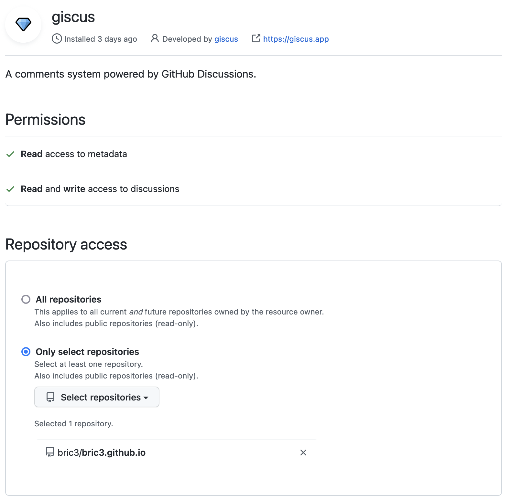
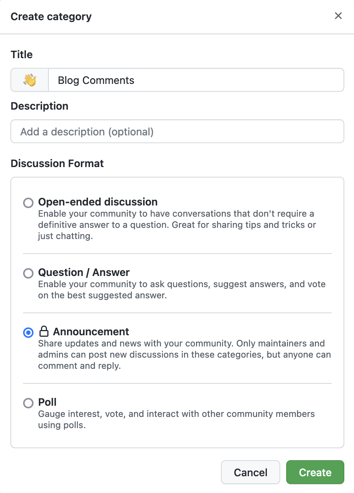

In the story of this blog I used WordPress, and using the WordPress comments
then moved to Discus as it was better at handling spam. Then I switched this
blog to GitHub with first Jekyll with markdown then finally to Hugo, this worked
well enough. Then lately I've been a bit more displeased by the Disqus editing
capability (no markdown (or asciidoc) support, no preview). More people
tend to have a GitHub account than a Disqus account (for tech blogs).
Also, GitHub introduced GitHub Discussions which was appealing to use with blogs.

This led me to finally do the migration from Disqus to GitHub Discussions.
The actual blog must use https://giscus.app/[Giscus]
a comment system that leverage the GitHub Discussions (https://github.com/giscus/giscus[giscus/giscus]).

== Preparing the migration

Before doing anything, I read some article from people who did the migration

* https://robjhyndman.com/hyndsight/disqus2giscus.html[Migrating from Disqus to giscus] by Rob J. Hyndman
* https://andrewlock.net/replacing-disqus-with-github-discussions-using-giscus/[Replacing Disqus with GitHub discussions using giscus] by Andrew Lock
* https://www.freecodecamp.org/news/github-discussions-as-chat-system/[How to use GitHub Discussions as Your Blog’s Chat System] by Rakesh Potnuru
* https://www.brycewray.com/posts/2022/05/tips-using-giscus/[Tips for using giscus] by Bryce Wray
* https://jbold569.github.io/profile/blog/2021-11-02-hello-github-discussions-goodbye-disqus.html[Hello, GitHub Discussions! Goodbye, Disqus…] by - Jason Bolden
* https://zhauniarovich.com/post/2021/2021-06-giscus/[Giscus: The New Commenting Engine for My Website] by Yury Zhauniarovich
* https://masalmon.eu/2019/10/02/disqus/[2019-10 Goodbye, Disqus! Hello, Utterances!] by Maëlle’s R.
* https://lazywinadmin.com/2019/04/moving_blog_comments.html[Moving my blog comments from Disqus to Github issues using PowerShell] by François-Xavier Cat

At the first glance the good thing is that the configuration of Giscus
is quite simple, you just need to follow the steps on the https://giscus.app/[Giscus] website.

This page will produce a script that needs to be placed at the bottom of the
blog post. That means that it's possible to adapt the script per page, typically
for some options that may be relevant like the comment interface language.

== Configuration

=== GitHub repository and Giscus

The main thing to configure is the repository where the comments will be stored.

1. Make sure the blog public
2. Enable the GitHub Discussions in the repository settings
3. Install the giscus app in the repository

By default, when enabling the GitHub Discussions the repository will have
default categories created, but you can create your own.
That's what I did. While any categories can be used with Giscus, I wanted
to restrain the ability to comment via the blog website, when creating the
blog category, I chose the _Announcement_ discussion format.

One could create a category for several language, and configure the Giscus script
according to the page's language.

=== Discussion mappings

But then what to do with the other options, in particular the _mapping_ of the
discussions, while this is not really an issue for a new blog, when migrating
the choice is important has it is how Giscus will perform the query to find
the relevant discussion.

So there are multiple options for mapping, at this time:

* `pathname`, the _GitHub Discussion title_ will be the
path of the blog post from the host root, this is the default option and likely
the most suitable choice for migration.

* `URL`, the _GitHub Discussion title_ will be the page's URL
this option works, but requires to have the same host.

* `title`, this means that the GitHub Discussion title will be the text contained
in the `<title>` HTML element.

* `og:title`, the _GitHub Discussion title_ will be the text contained in the
page's `<meta property="og:title">` HTML tag.

* `specific`, Giscus will find a specific term that has to appear in the _GitHub
Discussion title_. This is not useful when migrating existing blog comments, but
can be useful for specific pages.

* `number`, Giscus will use an existing discussion number. This is also not useful
when migrating existing blog comments, but can be useful for specific pages and
when the discussion already exists.

Along these Giscus has **strict** toggle. When this flag is activated, it will
hash (currently with SHA-1) the value of the selected mapping (the pathname,
the `<title>` value, the `<meta property="og:title">` value, etc.).
Giscus will use this value to retrieve the discussion, that means discussions
body must have this hash value somewhere.

[source]
----
<!-- sha1: cad60a29d1b50cbeb42ec2ff630fc508afb1d2e3 -->
----

=== Features and appearance

Then there are other options that affect appearance or features.

* `theme`, there are some predefined theme, I'm using the `preferred-color-scheme` since my blog also support this CSS media query (i.e it switches CSS according to light/dark mode). But this can be configured with a custom CSS file too.
* Reactions for the main blog post
* Discussion metadata
* Comment input location
* Lazy behavior

Other feature are possible in the https://github.com/giscus/giscus/blob/main/ADVANCED-USAGE.md[advanced usage guide].

== Hugo theme integration

Depending on [.line-through]#the technology# there are different ways to integrate Giscus ;
check the doc. I'm using https://gohugo.io/[Hugo] with a custom HTML tailored
for asciidoc content theme https://github.com/bric3/ascii-press[ascii-press].

So in the theme I just add to replace the previous Disqus script with
the Giscus one. Since I own the theme I directly replaced the template,
but other theme may require to override the partials (check Hugo documentation).

Since I wanted some flexibility in the configuration, I crafted the following
Hugo partial.

.giscus.html
[source]
----
{{- with .Site.Params.giscus }}
  {{- if or (not .repo) (not .repoId) (not .category) (not .categoryId) }}
    {{- errorf "[giscus] repo, repoId, category and categoryId are required." }}
  {{- end }}
  {{- $lang := default $.Site.Language.Lang }}
  
{{- end }}
----

And ended with the following configuration in the `config.toml` file.

.config.toml
[source,toml]
----
[params.giscus]
    repo = "bric3/bric3.github.io"
    repoId = "...."
    category = "Blog Comments"
    categoryID = "...."
    mapping = "pathname"
    reactions = true
    inputPosition = "top"
    theme = "preferred-color-scheme"
----

TIP: While this is not strictly necessary I also added a DNS Prefetch instruction
`<link rel="dns-prefetch" href="https://giscus.app">`.

That should be enough to get Giscus working, but what about the existing comments?

== Migration

The bad news is there's no official way to migrate/import comments from Disqus to Giscus
(https://github.com/giscus/giscus/issues/330[giscus/giscus#330]). And clearly
this was the most difficult part of this comment system chance task.
The only preliminary work that seems related on is about migrating Disqus to
GitHub issues (which is likely used by the https://utteranc.es[utteranc.es] comment system).

* https://github.com/JuergenGutsch/disqus-to-github-issues[JuergenGutsch/disqus-to-github-issues]

While some inspiration can be made from this project, it doesn't fit what can be
done with discussions.

So the first thing to do getting an extract of the Disqus comments, using the web interface
it's almost impossible to find the export menu.

E.g. the https://help.disqus.com/en/articles/1717199-importing-exporting#exporting-from-disqus[Importing & Exporting | Disqus]
documentation indicates to go there menu:Disqus Admin[Community > Export] then click btn:Export.
But I couldn't find this in their UI, instead I found this nifty link to access
the export page directly: http://disqus.com/admin/discussions/export/[Export].

The export is actually an XML document whose format is explained
https://docs.disqus.com/developers/export/[here].

The next step was to read that document, and create GitHub discussions from it
using the https://docs.github.com/en/graphql/guides/using-the-graphql-api-for-discussions[graphql API for discussions].

I wrote a small program in Java that can be run either with `java` (JDK 19) or
via `jbang` (https://jbang.dev/[jbang]). The latter is easier to use and will fetch
the necessary dependency to convert HTML to Markdown.

This program is available on this https://gist.github.com/bric3/af915687717d9aa06b0f9b06d600c127[gist].
Beware that it's not a polished program, there's some failsafe, but not every corner
case is handled.

[source, shell]
----
$ jbang https://gist.github.com/bric3/af915687717d9aa06b0f9b06d600c127 -h
Tool to migrate as best effort Disqus comment to GitHub Discussions.
Works best with 'jbang' (https://www.jbang.dev), but can be run with regular 'java' as well.
Note GitHub as undocumented resource rate limiting, on issues, discussions, which means the only option is to wait as long as necessary on large batch.

Usage:
  env GITHUB_TOKEN=... jbang Disqus2Giscus.java -f my-forum -e export.xml -r ghUser/repo -c "Discussion Category" -m pathname --host https://example.com -u author-mapping.csv -o "@bric3"
  env GITHUB_TOKEN=... java Disqus2Giscus.java -f my-forum -e export.xml -r ghUser/repo -c "Discussion Category" -m pathname --host https://example.com -u author-mapping.csv -o "@bric3"

Author extraction
  java Disqus2Giscus.java -f my-forum -e export.xml -a

Make sure the blog is ready and that https://giscus.app/ is installed.

HTML to Markdown available.

Options:
    -f, --forum-name <forum>             Disqus forum name
    -e, --export-file <file>             Disqus export file (From https://disqus.com/admin/discussions/export/)
    -r, --repo <repo>                    GitHub repository (owner/repo)
    -c, --target-category <category>     GitHub discussion category
    -m, --mapping <mapping>              Giscus discussion mapping mode
        --host <host>                    Site host, used for mapping mode 'pathname',
                                         removes the host from the link in exported
                                         comments.
    -a, --extract-authors                Extract author names from Disqus export file
    -u, --user-mapping-file <file>       [Optional] Author mapping file, CSV format:
                                         Disqus author name,GitHub user
    -o, --owner-account <owner>          [Optional] Discus or GitHub identifier
                                         for migrating owner's comments
        --[no-]convert-to-markdown       [Optional] Toggle markdown conversion of comments
                                         (Requires running with 'jbang' or having 'flexmark-all'
                                         dependency on the class path)
                                         (default: true)
    -s, --[no-]strict                    [Optional] Toggle giscus strict matching mode, this computes
                                         a hash of the blog title to match the discussion.
                                         (default: false)
    -t, --token <token>                  Alternative way to pass the GitHub token
    -n, --dry-run                        Dry run, do not create discussions on Github
    -h, --help                           Show this help
----

There are multiple option because I tried multiple approaches
to migrate the comments. In order to test what the result will be use the
_dry-mode_ `-n`.

In order to perform the migration I wanted to have the opportunity to map Disqus authors
to GitHub users. So the program has an option to export the users.

[source, shell]
----
$ jbang https://gist.github.com/bric3/af915687717d9aa06b0f9b06d600c127 \ <1>
  -f thecoffeeworkshop \ <2>
  -e disqus-export.xml \ <3>
  -a <4>
----
<1> Run the program with `jbang`
<2> The Disqus forum name, this is important if the export has multiple forums
<3> The Disqus export file
<4> Tell the program to extract the authors from the Disqus export file

The output is returning on the stand output authors in a single column. The content can then
be placed in a CSV file, where you can add the GitHub username, and delete the
lines where there's no known GitHub username.

TIP: I had to edit/fix some author name entries in the export in particular for
me as I entered some comment as anonymous on Disqus in the past.

.author-mapping.csv
[source, diff]
----
- Brice Dutheil
+ Brice Dutheil,@bric3 <1>
- Anonymous <2>
- Carlos
+ Carlos, @carlos <1>
- Bob <2>
----
<1> Disqus author name, GitHub user
<2> Users without GitHub username, which means the line has to be deleted

Then the program can be run again for the actual migration, for that more options
are required to control the migration, and in particular this requires a
https://github.com/settings/tokens[GitHub token] to access the GraphQL API.

[source, shell]
----
$ env GITHUB_TOKEN=$(op item get "Github" --fields "gh-cli") \ <1>
  jbang https://gist.github.com/bric3/af915687717d9aa06b0f9b06d600c127 \
 -f thecoffeeworkshop \ <2>
 -e disqus-export.xml \ <3>
 -r bric3/bric3.github.io \ <4>
 -c "Blog Comments" \ <5>
 -m pathname \ <6>
 --host https://blog.arkey.fr \ <7>
 -u author-mapping.csv \ <8>
 -o "@bric3" \ <9>
 -s <10>
----
<1> Pas the GitHub token to the program. Here as an example I'm using the
1Password cli `op` to retrieve the GitHub token.
<2> The Disqus forum name, this is important if the export has multiple forums
<3> The Disqus export file
<4> The GitHub repository where the discussions will be created
<5> The GitHub discussion category
<6> The mapping mode, here `pathname` will use the blog post path as the discussion title
<7> The blog host, this is used to remove the host from the link in the exported comments
<8> The author mapping file created above
<9> The owner account, this is used to tweak how to migrate the owner's comments
<10> The strict mode, this is used generate the hash of the value of the current
mapping mode, here the path will be hashed and inserted in the main discussion body.

CAUTION: The other mapping mode are supported, but I noticed that Disqus may
have encoded some characters a bit differently, so for example title values
in the blog and the value in the Disqus export may not match which means the
discussion won't be found. Additionally even the strict mode this will produce
different hashes. **So I would recommend to use the `pathname` mode.**

TIP: Try the export on a dummy repository first.

[[implementation-notes]]
.Implementation notes
****

* Requires a Java 19 install, possibly jbang for markdown conversion
* The Disqus threads are exported as a flat list, but they are in fact modeled
as a tree, with multiple child comments.
* The export contains deleted comments, and comments identified as spam.
They are filtered out.
* Some threads may have no comment, they are filtered out.
* GitHub Discussions are not like tress, there's one main discussion comment,
then a sub-level of comments, then a final second-level for replies. So
Disqus comments have to be re-ordered to match what GitHub Discussions
expect/accept.
* The Disqus export contains the comment body in HTML, this should work in
GitHub, but ideally these should be converted to Markdown.
* GitHub has different level of rate limiting.
** The HTTP API has a limit of 5000 requests per hour, HTTP statues, or header applies there.
** The GraphQL API has a different limit of 5000 requests per hour, because
a query may have a higher cost depending on the complexity of the query.
+
This can be queried, e.g. as part of another query (yet this is not possible when doing a `mutation`) :
+
[source,graphql]
----
query {
  // ...
  rateLimit { cost limit used remaining resetAt }
}
----
+
More details https://docs.github.com/en/graphql/overview/resource-limitations#rate-limit[here].
** There's also an undocumented limit during the creation of some resources, like
issues, PRs, or discussions. The goal is to combat abuse, however this is not practical
for migration. The limit manifests itself as an error in the response body (but
with an HTTP 200 OK status).
+
[source, json]
----
{
  "errors": [
    {
      "type": "UNPROCESSABLE",
      "message": "was submitted too quickly",
      "path": [ "createDiscussion" ]
    }
  ]
}
----
+
There's nothing else to be done than intercepting this error and _sleep_
for a moment before retrying, I chose a value of 60 seconds before retrying.
With the size my migration each pauses was more like 2 minutes, but pass:q[<abbr title="Your Mileage May Vary">YMMV</abbr>].
+
See https://github.com/cli/cli/issues/4801[cli/cli#4801] for more details.
* Creates new discussions only, in other words it won't merge existing ones.

****